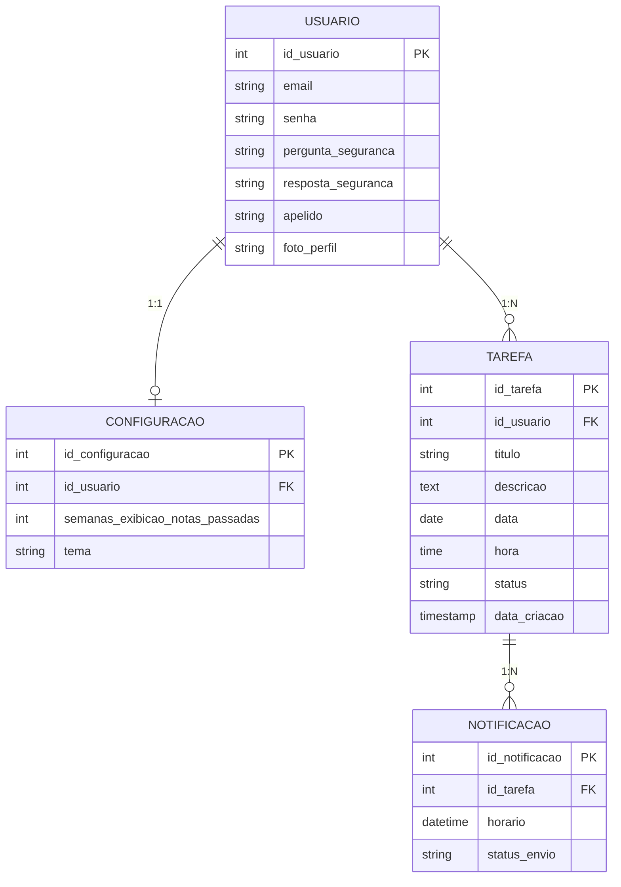

# Gerenciamento-de-Tarefas-Semanais

```mermaid
erDiagram
    USUARIO {
        int id_usuario PK
        string email
        string senha
        string pergunta_seguranca
        string resposta_seguranca
        string apelido
        string foto_perfil
    }
    CONFIGURACAO {
        int id_configuracao PK
        int id_usuario FK
        int semanas_exibicao_notas_passadas
        string tema
    }
    TAREFA {
        int id_tarefa PK
        int id_usuario FK
        string titulo
        text descricao
        date data
        time hora
        string status
        timestamp data_criacao
    }
    NOTIFICACAO {
        int id_notificacao PK
        int id_tarefa FK
        datetime horario
        string status_envio
    }

    USUARIO ||--o| CONFIGURACAO : "1:1"
    USUARIO ||--o{ TAREFA : "1:N"
    TAREFA ||--o{ NOTIFICACAO : "1:N"


    

```
